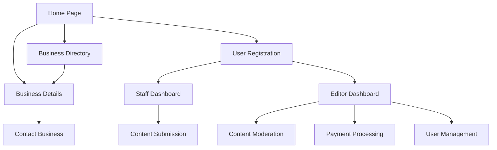

## 1. Product Overview

This project involves recreating a WordPress-based business directory and content management platform using Laravel. The original WordPress site includes GeoDirectory for business listings, staff management system, editor dashboards, and multilingual support through GTranslate.

The Laravel recreation will focus on public-facing features including business directory, user registration, content management, and administrative dashboards while maintaining the existing site's functionality and user experience.

## 2. Core Features

### 2.1 User Roles

| Role | Registration Method | Core Permissions |
|------|---------------------|------------------|
| Visitor | No registration required | Browse business listings, search, view content |
| Registered User | Email registration | Submit business listings, rate businesses, comment |
| Business Owner | Email + verification | Manage own business listings, respond to reviews |
| Staff Writer | Admin assignment | Create and edit content, manage submissions |
| Editor | Admin assignment | Full content management, user oversight, payment approval |
| Administrator | Manual setup | Full system access, user management, settings |

### 2.2 Feature Module

The platform consists of the following main pages:
1. **Home page**: Business directory search, featured listings, news articles, navigation menu.
2. **Business Directory**: Advanced search filters, category browsing, business listings with maps.
3. **Business Details**: Individual business pages with contact info, reviews, photos, location map.
4. **Staff Dashboard**: Content submission, profile management, earnings tracking for staff writers.
5. **Editor Dashboard**: Content review, user management, payment processing, system analytics.
6. **User Registration/Login**: Account creation, authentication, profile management.
7. **Search Results**: Advanced search results with filtering and sorting options.
8. **About/Contact**: Static informational pages with contact forms.

### 2.3 Page Details

| Page Name | Module Name | Feature description |
|-----------|-------------|---------------------|
| Home page | Hero Section | Display featured businesses, search bar, navigation to key sections. |
| Home page | Business Categories | Grid layout of business categories with icons and business counts. |
| Home page | Latest News | News articles section with pagination and category filtering. |
| Business Directory | Search Filters | Advanced filtering by category, location, rating, business type. |
| Business Directory | Map Integration | Interactive map showing business locations with markers. |
| Business Directory | Listing Cards | Business cards showing logo, name, rating, category, contact info. |
| Business Details | Business Info | Display complete business information, hours, contact details. |
| Business Details | Photo Gallery | Image carousel with business photos and user uploads. |
| Business Details | Reviews System | User reviews with ratings, comments, and moderation. |
| Business Details | Contact Form | Contact business directly through integrated form. |
| Staff Dashboard | Profile Management | Edit profile, view earnings, manage personal settings. |
| Staff Dashboard | Content Submission | Submit articles, business listings, media uploads. |
| Staff Dashboard | Payment Tracking | View earnings, payment history, withdrawal requests. |
| Editor Dashboard | User Management | Review and manage user accounts, role assignments. |
| Editor Dashboard | Content Moderation | Review submissions, approve/reject content, edit listings. |
| Editor Dashboard | Payment Processing | Process staff payments, manage payment methods. |
| Editor Dashboard | Analytics | View site statistics, user activity, revenue reports. |
| Registration/Login | User Registration | Email-based registration with verification. |
| Registration/Login | Social Login | Optional social media authentication integration. |
| Registration/Login | Password Recovery | Secure password reset functionality. |

## 3. Core Process

### Visitor Flow
Users can browse the business directory without registration, search for businesses by category or location, view business details including reviews and photos, and contact businesses through provided information.

### Registered User Flow
Users register with email, can submit business listings for approval, rate and review existing businesses, save favorite businesses, and receive notifications about their submissions.

### Staff Writer Flow
Staff writers log into the dashboard, submit content and business listings, track their earnings from approved submissions, and manage their profile information.

### Editor Flow
Editors access the comprehensive dashboard to review all user submissions, approve or reject content, process payments to staff writers, manage user accounts, and view system analytics.

### Business Owner Flow
Business owners claim their business listings, update business information, respond to customer reviews, upload photos, and manage their business profile.

## 4. User Interface Design

### 4.1 Design Style
- **Primary Colors**: Blue (#0066cc) for primary actions, white for backgrounds, gray (#f8f9fa) for secondary backgrounds
- **Secondary Colors**: Green (#28a745) for success states, red (#dc3545) for errors, orange (#ffc107) for warnings
- **Button Style**: Rounded corners (4px radius), hover effects, clear visual hierarchy
- **Typography**: System fonts (Apple System, Segoe UI, Roboto), 16px base size, responsive scaling
- **Layout**: Card-based design, responsive grid system, mobile-first approach
- **Icons**: Font Awesome icons, consistent sizing and color scheme

### 4.2 Page Design Overview

| Page Name | Module Name | UI Elements |
|-----------|-------------|-------------|
| Home page | Hero Section | Full-width banner with search bar overlay, prominent call-to-action buttons. |
| Home page | Business Categories | 3-column grid on desktop, single column on mobile, hover effects on cards. |
| Business Directory | Search Interface | Collapsible filter sidebar, search input with autocomplete, map toggle button. |
| Business Details | Header Section | Business logo, name, rating stars, category badge, contact buttons. |
| Staff Dashboard | Navigation | Sidebar menu with icons, active state highlighting, responsive hamburger menu. |
| Editor Dashboard | Data Tables | Sortable columns, pagination controls, bulk actions dropdown, search within tables. |

### 4.3 Responsiveness
The platform follows a desktop-first design approach with full mobile responsiveness. All pages adapt to tablet and mobile screen sizes with touch-optimized interactions, collapsible navigation menus, and appropriately sized touch targets.

### 4.4 3D Scene Guidance
Not applicable for this business directory platform - the focus is on 2D user interfaces with interactive maps for business locations.