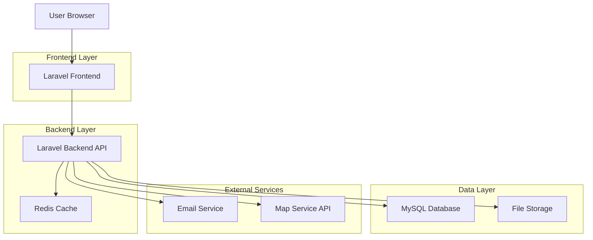
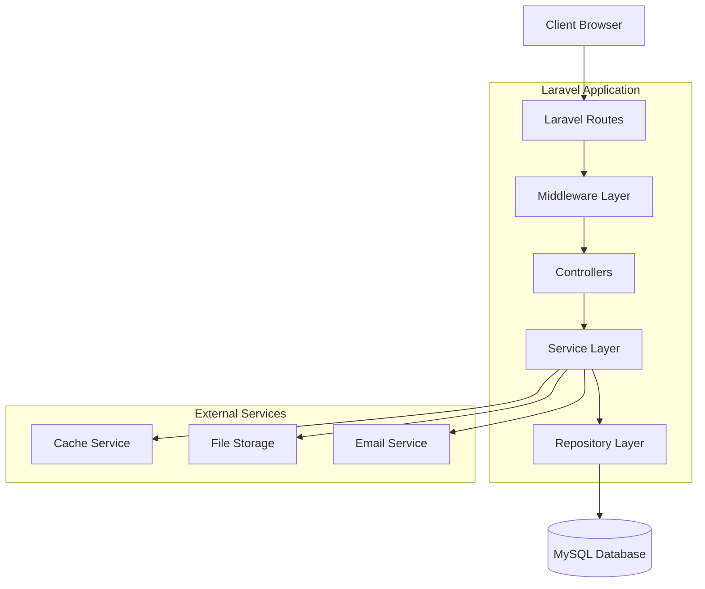
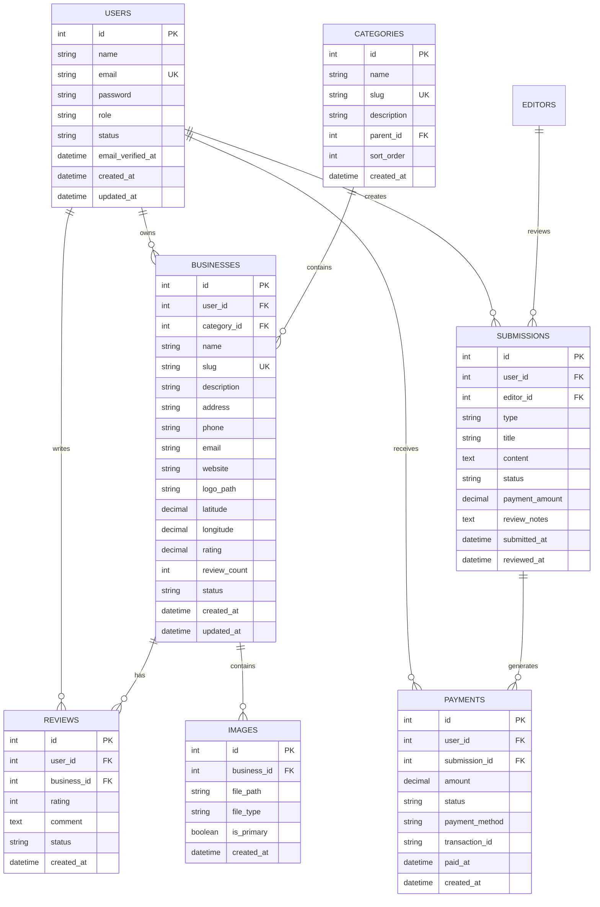

## 1. Architecture Design



## 2. Technology Description

- **Backend**: Laravel 10.x with PHP 8.1+
- **Frontend**: Laravel Blade templates with Bootstrap 5, Alpine.js for interactivity
- **Database**: MySQL 8.0 with Laravel Eloquent ORM
- **Cache**: Redis for session storage and data caching
- **File Storage**: Laravel Storage with local/cloud drivers
- **Email**: Laravel Mail with SMTP configuration
- **Maps**: Integration with Google Maps or OpenStreetMap APIs
- **Authentication**: Laravel Sanctum for API authentication, Laravel Auth for web
- **Queue**: Laravel Queue with Redis driver for background jobs

## 3. Route Definitions

| Route | Purpose |
|-------|---------|
| / | Home page with business directory and news |
| /businesses | Business directory with search and filtering |
| /business/{slug} | Individual business details page |
| /categories/{category} | Business listings by category |
| /search | Advanced search results |
| /login | User authentication page |
| /register | User registration page |
| /dashboard | User dashboard (redirects based on role) |
| /staff/dashboard | Staff writer dashboard |
| /editor/dashboard | Editor administration dashboard |
| /business/submit | Business listing submission form |
| /profile | User profile management |
| /api/businesses | API endpoint for business data |
| /api/search | API endpoint for search functionality |
| /api/staff/* | Staff dashboard API endpoints |
| /api/editor/* | Editor dashboard API endpoints |

## 4. API Definitions

### 4.1 Business Management API

**Get Business Listings**
```
GET /api/businesses
```

Request Parameters:
| Param Name | Param Type | isRequired | Description |
|------------|------------|------------|-------------|
| category | string | false | Filter by business category |
| location | string | false | Filter by location |
| search | string | false | Search term |
| page | integer | false | Page number for pagination |
| per_page | integer | false | Items per page (default: 20) |

Response:
```json
{
  "data": [
    {
      "id": 1,
      "name": "Business Name",
      "slug": "business-name",
      "description": "Business description...",
      "category": "Restaurant",
      "rating": 4.5,
      "address": "123 Main St",
      "phone": "555-1234",
      "email": "info@business.com",
      "website": "https://business.com",
      "logo": "/storage/logos/business-logo.png",
      "latitude": 40.7128,
      "longitude": -74.0060,
      "created_at": "2024-01-01T00:00:00Z"
    }
  ],
  "meta": {
    "current_page": 1,
    "total_pages": 10,
    "total_items": 200
  }
}
```

**Submit Business Listing**
```
POST /api/businesses/submit
```

Request:
| Param Name | Param Type | isRequired | Description |
|------------|------------|------------|-------------|
| name | string | true | Business name |
| description | string | true | Business description |
| category_id | integer | true | Category ID |
| address | string | true | Business address |
| phone | string | false | Contact phone |
| email | string | false | Contact email |
| website | string | false | Business website |
| logo | file | false | Business logo image |
| images | array | false | Additional business images |

### 4.2 Staff Dashboard API

**Get Staff Dashboard Stats**
```
GET /api/staff/dashboard/stats
```

Headers:
```
Authorization: Bearer {token}
```

Response:
```json
{
  "total_submissions": 25,
  "approved_submissions": 18,
  "pending_submissions": 5,
  "rejected_submissions": 2,
  "total_earnings": 450.00,
  "pending_earnings": 75.00,
  "profile_completion": 85
}
```

**Submit Content**
```
POST /api/staff/content/submit
```

Request:
| Param Name | Param Type | isRequired | Description |
|------------|------------|------------|-------------|
| title | string | true | Content title |
| content | string | true | Content body |
| type | string | true | Type: 'article' or 'business' |
| category | string | false | Content category |
| images | array | false | Associated images |
| tags | array | false | Content tags |

### 4.3 Editor Dashboard API

**Get All Submissions**
```
GET /api/editor/submissions
```

Request Parameters:
| Param Name | Param Type | isRequired | Description |
|------------|------------|------------|-------------|
| status | string | false | Filter by status: 'pending', 'approved', 'rejected' |
| type | string | false | Filter by type: 'article', 'business' |
| user_id | integer | false | Filter by submitter |
| page | integer | false | Page number |

**Update Submission Status**
```
PUT /api/editor/submissions/{id}/status
```

Request:
| Param Name | Param Type | isRequired | Description |
|------------|------------|------------|-------------|
| status | string | true | New status: 'approved', 'rejected' |
| notes | string | false | Review notes |
| payment_amount | decimal | false | Payment amount if approved |

## 5. Server Architecture Diagram



## 6. Data Model

### 6.1 Data Model Definition



### 6.2 Data Definition Language

**Users Table**
```sql
CREATE TABLE users (
    id BIGINT UNSIGNED AUTO_INCREMENT PRIMARY KEY,
    name VARCHAR(255) NOT NULL,
    email VARCHAR(255) UNIQUE NOT NULL,
    email_verified_at TIMESTAMP NULL,
    password VARCHAR(255) NOT NULL,
    role ENUM('visitor', 'registered', 'business_owner', 'staff_writer', 'editor', 'admin') DEFAULT 'visitor',
    status ENUM('active', 'inactive', 'suspended') DEFAULT 'active',
    remember_token VARCHAR(100) NULL,
    created_at TIMESTAMP DEFAULT CURRENT_TIMESTAMP,
    updated_at TIMESTAMP DEFAULT CURRENT_TIMESTAMP ON UPDATE CURRENT_TIMESTAMP,
    INDEX idx_email (email),
    INDEX idx_role (role),
    INDEX idx_status (status)
);
```

**Categories Table**
```sql
CREATE TABLE categories (
    id BIGINT UNSIGNED AUTO_INCREMENT PRIMARY KEY,
    name VARCHAR(255) NOT NULL,
    slug VARCHAR(255) UNIQUE NOT NULL,
    description TEXT,
    parent_id BIGINT UNSIGNED NULL,
    sort_order INT DEFAULT 0,
    created_at TIMESTAMP DEFAULT CURRENT_TIMESTAMP,
    FOREIGN KEY (parent_id) REFERENCES categories(id) ON DELETE SET NULL,
    INDEX idx_slug (slug),
    INDEX idx_parent (parent_id)
);
```

**Businesses Table**
```sql
CREATE TABLE businesses (
    id BIGINT UNSIGNED AUTO_INCREMENT PRIMARY KEY,
    user_id BIGINT UNSIGNED NOT NULL,
    category_id BIGINT UNSIGNED NOT NULL,
    name VARCHAR(255) NOT NULL,
    slug VARCHAR(255) UNIQUE NOT NULL,
    description TEXT,
    address VARCHAR(500),
    phone VARCHAR(50),
    email VARCHAR(255),
    website VARCHAR(500),
    logo_path VARCHAR(500),
    latitude DECIMAL(10, 8),
    longitude DECIMAL(11, 8),
    rating DECIMAL(3, 2) DEFAULT 0.00,
    review_count INT DEFAULT 0,
    status ENUM('pending', 'approved', 'rejected', 'suspended') DEFAULT 'pending',
    created_at TIMESTAMP DEFAULT CURRENT_TIMESTAMP,
    updated_at TIMESTAMP DEFAULT CURRENT_TIMESTAMP ON UPDATE CURRENT_TIMESTAMP,
    FOREIGN KEY (user_id) REFERENCES users(id) ON DELETE CASCADE,
    FOREIGN KEY (category_id) REFERENCES categories(id) ON DELETE RESTRICT,
    INDEX idx_user (user_id),
    INDEX idx_category (category_id),
    INDEX idx_status (status),
    INDEX idx_rating (rating),
    INDEX idx_slug (slug)
);
```

**Submissions Table**
```sql
CREATE TABLE submissions (
    id BIGINT UNSIGNED AUTO_INCREMENT PRIMARY KEY,
    user_id BIGINT UNSIGNED NOT NULL,
    editor_id BIGINT UNSIGNED NULL,
    type ENUM('article', 'business') NOT NULL,
    title VARCHAR(500) NOT NULL,
    content TEXT,
    status ENUM('pending', 'approved', 'rejected', 'revision_requested') DEFAULT 'pending',
    payment_amount DECIMAL(10, 2) DEFAULT 0.00,
    review_notes TEXT,
    submitted_at TIMESTAMP DEFAULT CURRENT_TIMESTAMP,
    reviewed_at TIMESTAMP NULL,
    created_at TIMESTAMP DEFAULT CURRENT_TIMESTAMP,
    updated_at TIMESTAMP DEFAULT CURRENT_TIMESTAMP ON UPDATE CURRENT_TIMESTAMP,
    FOREIGN KEY (user_id) REFERENCES users(id) ON DELETE CASCADE,
    FOREIGN KEY (editor_id) REFERENCES users(id) ON DELETE SET NULL,
    INDEX idx_user (user_id),
    INDEX idx_editor (editor_id),
    INDEX idx_type (type),
    INDEX idx_status (status),
    INDEX idx_submitted (submitted_at)
);
```

**Reviews Table**
```sql
CREATE TABLE reviews (
    id BIGINT UNSIGNED AUTO_INCREMENT PRIMARY KEY,
    user_id BIGINT UNSIGNED NOT NULL,
    business_id BIGINT UNSIGNED NOT NULL,
    rating TINYINT CHECK (rating >= 1 AND rating <= 5),
    comment TEXT,
    status ENUM('pending', 'approved', 'rejected') DEFAULT 'pending',
    created_at TIMESTAMP DEFAULT CURRENT_TIMESTAMP,
    FOREIGN KEY (user_id) REFERENCES users(id) ON DELETE CASCADE,
    FOREIGN KEY (business_id) REFERENCES businesses(id) ON DELETE CASCADE,
    UNIQUE KEY unique_user_business (user_id, business_id),
    INDEX idx_business (business_id),
    INDEX idx_rating (rating),
    INDEX idx_status (status)
);
```

**Payments Table**
```sql
CREATE TABLE payments (
    id BIGINT UNSIGNED AUTO_INCREMENT PRIMARY KEY,
    user_id BIGINT UNSIGNED NOT NULL,
    submission_id BIGINT UNSIGNED NULL,
    amount DECIMAL(10, 2) NOT NULL,
    status ENUM('pending', 'processing', 'completed', 'failed', 'refunded') DEFAULT 'pending',
    payment_method VARCHAR(100),
    transaction_id VARCHAR(255),
    paid_at TIMESTAMP NULL,
    created_at TIMESTAMP DEFAULT CURRENT_TIMESTAMP,
    updated_at TIMESTAMP DEFAULT CURRENT_TIMESTAMP ON UPDATE CURRENT_TIMESTAMP,
    FOREIGN KEY (user_id) REFERENCES users(id) ON DELETE CASCADE,
    FOREIGN KEY (submission_id) REFERENCES submissions(id) ON DELETE SET NULL,
    INDEX idx_user (user_id),
    INDEX idx_submission (submission_id),
    INDEX idx_status (status),
    INDEX idx_created (created_at)
);
```